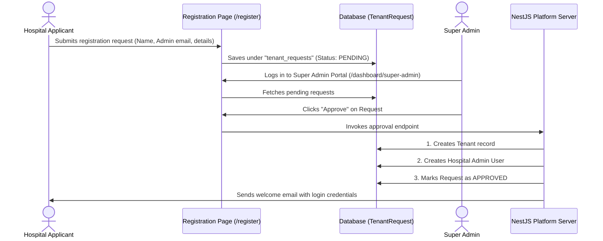
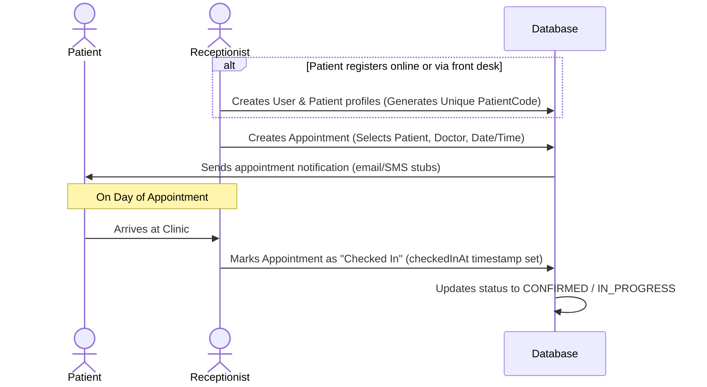
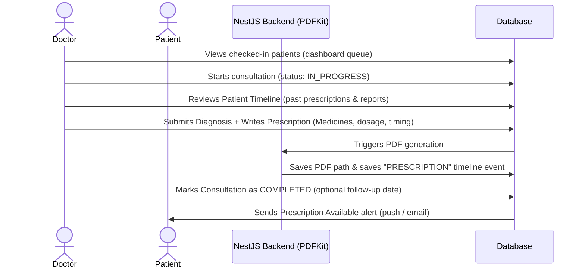
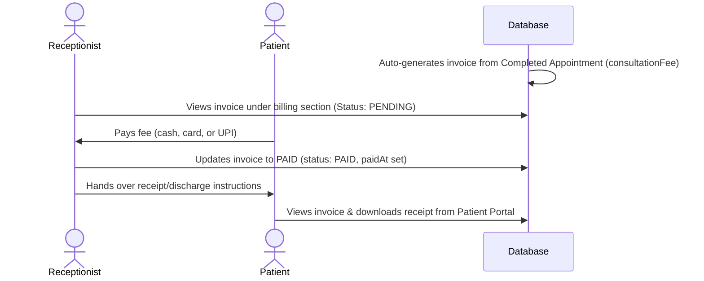

# Arogyix — App Flow, Roles, and Demo Script

This document details the multi-tenant SaaS architecture of **Arogyix**, the granular permissions of all five user roles, the core business flows, and a step-by-step script to test or demo the end-to-end application lifecycle.

---

## 🏗️ System & Tenant Architecture

Arogyix is built on a **multi-tenant architecture** where every hospital or clinic is an isolated tenant:
- **Tenant Isolation**: Every database table containing tenant-scoped data (Users, Patients, Doctors, Appointments, Invoices, Prescriptions, Reports) contains a `tenantId` field. NestJS backend guards filter database queries by `tenantId` (extracted from the authenticated JWT token) to prevent cross-tenant data leaks.
- **Shared Platform Level**: The `SUPER_ADMIN` acts at the platform level (above individual tenants) to manage all hospitals (`Tenant`), subscription plans, and verify new clinic onboarding requests (`TenantRequest`).

---

## 👥 Role-Based Access Control (RBAC) Matrix

Arogyix defines 5 distinct user roles. Below is the mapping of each role's dashboard routes, responsibilities, and permissions:

| Role | Frontend Route Prefix | Primary Responsibilities | Data Scope / Permissions |
| :--- | :--- | :--- | :--- |
| **`SUPER_ADMIN`** | `/dashboard/super-admin` | Platform governance, approving new hospitals, managing billing/subscriptions | Platform-wide. Can read/write all `Tenant` records and approve/reject pending `TenantRequest` entries. |
| **`HOSPITAL_ADMIN`** | `/dashboard/hospital` | Hospital configuration, clinic settings, department mapping, staff management | Tenant-scoped. Full administrative access to their specific `Tenant` profile, `Department` listing, and inviting/registering/disabling `Doctor` and `Receptionist` accounts. |
| **`DOCTOR`** | `/dashboard/doctor` | Consultation slot scheduling, conducting patient clinical examinations, e-prescribing, chat | Tenant-scoped. Read-write access to their personal availability, appointments assigned to them, writing prescriptions, viewing patient timeline history, and chatting with patients. |
| **`RECEPTIONIST`** | `/dashboard/receptionist` | Front desk operations, registering patients, scheduling and rescheduling appointments, collecting payments | Tenant-scoped. Read-write access to all patient registrations, patient check-ins, creating invoices, and updating invoice payment status. Cannot prescribe or modify clinical records. |
| **`PATIENT`** | `/dashboard/patient` | Viewing historical health documents, looking up prescriptions, tracking medicine intake, booking appointments | Tenant-scoped / Self-only. Read-only access to their own prescriptions, medical reports, invoices, and timeline. Can book appointments and chat with assigned doctors. |

---

## 🔄 Core Application Flows (Visualized)

The application revolves around four primary business workflows: Onboarding, Checking In/Booking, Consulting/Prescribing, and Billing/Discharge.

### 1. SaaS Onboarding & Approval Flow

### 2. Patient Check-In & Appointment Scheduling

### 3. Consultation & E-Prescribing Flow

### 4. Billing & Discharge Flow

---

## 📝 Step-by-Step Application Demo & Verification Script

Use this walkthrough script to demo the application or verify that every role-specific flow functions correctly.

### Seeded Credentials for Testing
- **Super Admin**: `superadmin@Arogyix.health` / `Password123!`
- **Hospital Admin**: `admin@Arogyix.health` / `Password123!`
- **Doctor**: `doctor@Arogyix.health` / `Password123!`
- **Receptionist**: `receptionist@Arogyix.health` / `Password123!`
- **Patient**: `patient@Arogyix.health` / `Password123!`

---

### Phase 1: Onboard a New Clinic (SaaS Signup & Approval)
*Goal: Demonstrate the registration of a new SaaS tenant and subsequent Super Admin approval.*

1. **Submit Signup Request**:
   - Go to `http://localhost:3000/register`.
   - Select **Register Hospital/Clinic**.
   - Enter details for a new hospital (e.g., `City Hospital`, admin email `cityadmin@Arogyix.health`, first/last name, phone).
   - Submit the form.
2. **Approve Request**:
   - Navigate to `http://localhost:3000/login` and log in as the **Super Admin** (`superadmin@Arogyix.health` / `Password123!`).
   - Go to `/dashboard/super-admin` to view the **Pending Requests** table.
   - Find the entry for `City Hospital` and click **Approve**.
   - *Verification*: The request status changes to `Approved`. A new tenant record for `City Hospital` is provisioned, and the admin account `cityadmin@Arogyix.health` is registered.

---

### Phase 2: Staff Provisioning & Configuration
*Goal: Hospital Admin configures departments and registers clinical and administrative staff.*

1. **Log in as Hospital Admin**:
   - Log out of Super Admin and log back in using the default Hospital Admin: `admin@Arogyix.health` / `Password123!`.
2. **Add a Department**:
   - Navigate to `/dashboard/departments`.
   - Click **Add Department** and create a department (e.g., `Cardiology`).
3. **Invite / Register Staff**:
   - Navigate to `/dashboard/staff` or `/dashboard/hospital/staff`.
   - Click **Add Staff Member** and select the **Doctor** role. Enter credentials (e.g., email `cardio_doc@Arogyix.health`, assign to `Cardiology`).
   - Add another staff member with the **Receptionist** role (e.g., email `frontdesk@Arogyix.health`).
   - *Verification*: Verify that the new doctor and receptionist profiles are active under the user directory.

---

### Phase 3: Patient Booking & Front-Desk Check-In
*Goal: Receptionist registers a patient, schedules an appointment, and checks them in.*

1. **Log in as Receptionist**:
   - Log in with `receptionist@Arogyix.health` / `Password123!`.
2. **Register a Patient**:
   - Navigate to `/dashboard/patients`.
   - Click **Add Patient** and fill out the patient's personal details (Name, DOB, gender, blood group, emergency contact).
   - Submit the form. A unique **Patient Code** (e.g., `PAT-XXXX`) is automatically generated.
3. **Book an Appointment**:
   - Navigate to `/dashboard/appointments` or click **Book Appointment**.
   - Search and select the registered patient.
   - Choose the doctor (e.g., `doctor@Arogyix.health` or the newly created doctor).
   - Choose a date and time slot, then click **Schedule**.
   - *Verification*: The appointment appears in the schedule calendar with a status of `SCHEDULED`.
4. **Check-In Patient**:
   - On the today's appointments queue, locate the scheduled appointment.
   - Click **Check In**.
   - *Verification*: The status updates to `CONFIRMED` or `IN_PROGRESS` (visualized by a status color change, e.g., yellow to blue), updating the checked-in queue.

---

### Phase 4: Clinical Consultation & E-Prescribing
*Goal: Doctor reviews patient history, records diagnosis, issues a digital prescription, and triggers automated PDF creation.*

1. **Log in as Doctor**:
   - Log in with `doctor@Arogyix.health` / `Password123!`.
2. **Examine Patient**:
   - Go to `/dashboard/doctor` to view your active workspace queue.
   - Under **Today's Appointments** or **Checked In**, select the patient checked in during Phase 3.
   - Click **Start Consultation** (status becomes `IN_PROGRESS`).
   - Observe the **Patient Timeline** showing chronological reports, past consultation dates, and reminders.
3. **Write E-Prescription**:
   - Under the consultation form, input a **Diagnosis** (e.g., `Essential Hypertension`) and **Clinical Notes**.
   - Click **Add Medicine** and type a name (e.g., `Amlodipine 5mg`).
   - Input **Dosage** (`1 tablet`), **Frequency** (`Once Daily`), **Duration** (`30 Days`), and **Timing** (`AFTER_FOOD`).
   - Click **Generate Prescription & Complete**.
   - *Verification*: The consultation status becomes `COMPLETED`. The prescription triggers a background PDFKit generator, saving the PDF to the report index. A timeline event `PRESCRIPTION` is appended to the patient's profile.

---

### Phase 5: Billing & Discharge
*Goal: Receptionist reviews the generated invoice, takes payment, and marks it as paid.*

1. **Log in as Receptionist**:
   - Log back in with `receptionist@Arogyix.health` / `Password123!`.
2. **Collect Payment**:
   - Navigate to `/dashboard/billing`.
   - Locate the invoice automatically generated for the completed appointment (matched by the doctor's consultation fee). The status should be `PENDING`.
   - Click **Collect Payment**, select the payment method (e.g., Cash or Card), and click **Mark as Paid**.
   - *Verification*: The invoice status updates to `PAID`. The timestamp `paidAt` is populated, and a printed receipt becomes available.

---

### Phase 6: Patient Review & Care Management
*Goal: Patient logs in to view documents, download prescriptions, check reminders, and chat with their doctor.*

1. **Log in as Patient**:
   - Log in with `patient@Arogyix.health` / `Password123!`.
2. **Access Health Records**:
   - Navigate to `/dashboard/patient`.
   - Under **My Prescriptions**, click the entry generated in Phase 4. Click **Download PDF** to preview the layout.
   - Under **Medical Timeline**, review the log indicating that the consultation is complete and a prescription was issued.
3. **Use Patient-Doctor Chat**:
   - Click on the **Chat** icon or go to the chat route.
   - Select the consulting doctor from the active list.
   - Send a message (e.g., *"Should I take the medicine before food if I experience stomach discomfort?"*).
   - Log back in as the **Doctor** (`doctor@Arogyix.health`) and verify the message appears in real-time via Socket.io. Respond back to complete the loop.

---

## ⚙️ Technical System Utilities & Background Jobs

To ensure the care flow runs seamlessly without direct staff intervention, two backend helper modules process async jobs:

1. **Medicine Reminders (Cron)**:
   - **Service**: `RemindersService` (`/backend/src/reminders`) running every 15 minutes.
   - **Action**: Queries the `MedicineReminder` table for any `PENDING` reminders scheduled for the current interval, dispatches push alerts/SMS/emails to patients, and marks the status as `SENT` or `FAILED`.
2. **Notification Gateway**:
   - **Service**: `/backend/src/notifications` handles multi-channel alerts (Push notification, Nodemailer/Email, Twilio/SMS, WhatsApp templates) based on the user's preference settings.
