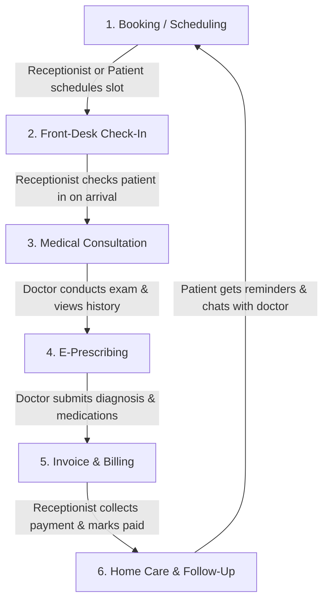

# Arogyix — Application Flow & Features Guide

Welcome to the **Arogyix** Application Flow and Features Guide. This document provides a complete overview of the user onboarding processes, end-to-end clinical workflows, and feature directories for all users, completely free of technical jargon.

---

## 👥 1. Platform Roles Overview

Arogyix is a multi-clinic healthcare management platform. The system coordinates care through five distinct roles:

*   **Super Admin (Platform Owner)**: Governs the entire platform, approves new hospital sign-ups, and oversees clinic subscriptions.
*   **Hospital Admin (Clinic Owner)**: Manages clinic settings, departments, and onboarding/management of clinical and administrative staff.
*   **Receptionist (Front-Desk Staff)**: Registers patients, handles appointment scheduling, checks patients in upon arrival, and manages billing and payments.
*   **Doctor (Medical Staff)**: Examines patients, reviews medical history, writes digital prescriptions, and answers patient follow-up queries.
*   **Patient (Care Recipient)**: Accesses personal medical history, downloads prescriptions, books appointments, receives medicine reminders, and chats with their doctor.

---

## 🔑 2. User Registration & Onboarding Process

Every user enters the platform through one of these distinct onboarding pathways:

### 🏢 Hospital & Hospital Admin Onboarding
1.  **Application Submission**: A hospital representative visits the registration portal and submits an onboarding application with the hospital's details (name, contact info) and the administrator's profile details (name, email, password).
2.  **Platform Review**: The application is stored in a pending queue on the platform.
3.  **Approval & Activation**: The Super Admin reviews and approves the application. Upon approval, the hospital's workspace is initialized, and the Hospital Admin account is activated. The administrator can now log in and configure their clinic.

### 👩‍⚕️ Hospital Staff (Doctors & Receptionists)
1.  **Staff Profile Creation**: The Hospital Admin logs into their clinic dashboard, navigates to the staff directory, and selects **Add Staff Member**.
2.  **Information Entry**: The admin enters the employee's name, email, desired role (Doctor or Receptionist), and temporary password. For doctors, the admin also assigns them to a department (e.g., Cardiology, General Medicine).
3.  **Account Ready**: Once saved, the account is active. The staff member can immediately log in using their credentials and start managing their workspace.

### 🤒 Patients
*   **Path A: Front-Desk Registration (Standard)**:
    When a patient visits the clinic, the Receptionist collects their demographics (Name, Date of Birth, gender, contact number, blood group, emergency contact) and registers them. The system automatically creates a patient profile and generates a unique **Patient Code** (e.g., `PAT-0042`) to index all future medical files.
*   **Path B: Online Self-Registration**:
    Patients can visit the Arogyix portal, click register, and enter their name, email, phone number, and password to create an account. They can immediately log in to access the patient dashboard.

### 👑 Super Admin
*   This is the system administrator role responsible for platform-wide operations. This account is pre-provisioned at installation and cannot be registered publicly.

---

## 🔄 3. End-to-End Clinic Workflow (The Care Lifecycle)

The primary day-to-day operations of the clinic follow a circular workflow from scheduling to home care:

### Step 1: Appointment Scheduling
*   **Booking**: A receptionist schedules an appointment on behalf of a patient (searching by name/code), or the patient books it themselves via the patient portal.
*   **Details**: The scheduler selects the patient, the desired doctor, and an available date and time slot.
*   **Status**: The appointment is marked as **Scheduled**.

### Step 2: Patient Arrival & Check-In
*   **Arrival**: The patient arrives at the clinic and checks in at the front desk.
*   **Check-In**: The receptionist finds the patient's scheduled appointment for the day and clicks **Check In**.
*   **Status**: The patient is added to the doctor's queue, and the appointment status updates to **Checked In** / **In Progress**.

### Step 3: Medical Examination & Consultation
*   **Consultation Queue**: The doctor views their workspace dashboard and sees a real-time list of checked-in patients waiting for them.
*   **Timeline Review**: The doctor opens the patient's profile and reviews their complete **Medical Timeline**, which compiles all past visit summaries, diagnostic reports, and historical prescriptions in chronological order.
*   **Clinical Consultation**: The doctor examines the patient, enters clinical consultation notes, and documents the diagnosis.

### Step 4: Digital Prescribing (E-Prescriptions)
*   **Prescription Generation**: Within the consultation form, the doctor adds the list of required medications. For each medication, they specify:
    *   Medicine name (e.g., *Amoxicillin 500mg*)
    *   Dosage instruction (e.g., *1 capsule*)
    *   Frequency (e.g., *Three times daily*)
    *   Duration (e.g., *7 days*)
    *   Timing (e.g., *After food*)
*   **Finalization**: The doctor submits the consultation, which automatically closes the consultation session, moves the patient to the billing queue, and generates a professional, readable digital prescription PDF.

### Step 5: Billing & Discharge
*   **Invoice Generation**: Once the doctor completes the consultation, the system automatically generates an invoice containing the doctor's consultation fee and any relevant clinic fees.
*   **Payment Collection**: The patient returns to the front desk. The receptionist locates the pending invoice, collects payment via the patient's preferred method (cash, card, or digital payment), and marks the invoice as **Paid**.
*   **Receipt**: The receptionist prints or hands over a physical receipt, and a digital receipt is instantly published to the patient's portal.

### Step 6: Home Care, Reminders & Communication
*   **Prescription Access**: The patient can log into their portal at home to download their digital prescription and view their clinical instructions.
*   **Medication Reminders**: Based on the schedule written in the prescription, the system sends automated alerts (e.g., via SMS, email, or browser notifications) reminding the patient when it is time to take each medication.
*   **Direct Chat**: If the patient has questions about their treatment (e.g., *"Should I stop taking this medication if I feel dizzy?"*), they can open a secure chat portal to message their doctor directly. The doctor receives this message on their dashboard and can reply in real-time.

---

## 🛠️ 4. Detailed Feature Directory

Here is the breakdown of features available to each user role, explained in simple terms:

### 👑 Super Admin Portal Features
*   **Hospital Applications Board**: A dashboard displaying all pending requests from new clinics wishing to join the platform. Features include viewing application forms, approving access, and deactivating tenants.
*   **Hospital Workspace Directory**: A directory of all active hospital accounts on the platform, showing their status, registration date, and administrator contact information.

### 🏢 Hospital Admin Dashboard Features
*   **Staff Registry**: A central hub to manage all clinic employees. Allows registering new doctors and receptionists, updating their profile information, or deactivating accounts when staff members leave the clinic.
*   **Department Configuration**: A tool to create clinical departments (e.g., Cardiology, Pediatrics, Orthopedics) to organize the staff listing and simplify booking processes.
*   **Clinic Information Portal**: A profile editor to update the clinic's public name, contact numbers, address, and operating hours.

### 👩‍💼 Receptionist Dashboard Features
*   **Master Patient Index**: A searchable directory of all registered patients. Provides options to add new patients, view their basic details, and search by Name, Phone Number, or Patient Code.
*   **Appointment Manager**: An interactive booking calendar to schedule appointments, reschedule slots, and cancel appointments.
*   **Front-Desk Check-In Queue**: A real-time tracker displaying patients scheduled for the day, allowing the receptionist to check them in or mark them as "No-Show".
*   **Billing Ledger**: A financial tab containing all generated bills. Receptionists can view unpaid invoices, record payments, and print invoices or payment receipts.

### 👩‍⚕️ Doctor Dashboard Features
*   **Daily Patient Queue**: A workspace displaying checked-in patients who are waiting for their appointment, helping the doctor prioritize their day.
*   **Interactive Medical Timeline**: A comprehensive chart that aggregates all of the patient's medical history from previous visits, including diagnostic reports, previous diagnoses, and prescriptions.
*   **Consultation Board**: An editor where the doctor writes down clinical notes, diagnoses, and lists prescribed medications.
*   **Direct Patient Messenger**: A communication panel where doctors can chat with patients who have been assigned to them for care, keeping consultations private and secure.

### 🤒 Patient Dashboard Features
*   **Personal Health Ledger**: A self-service portal where patients can view their historical prescriptions, download digital PDFs, and read clinical notes written by their doctors.
*   **Personal Medical Timeline**: A visual timeline showing the chronological history of their health events, appointments, and consultations.
*   **Appointment Scheduler**: A feature allowing patients to request appointments online with specific doctors at available times.
*   **Medication Planner & Reminders**: A schedule display detailing what medicines to take and when, integrated with automatic reminders sent directly to the patient's device or inbox.
*   **Doctor Chat Messenger**: A chat client that allows patients to send messages to their consulting doctors for follow-up questions.
