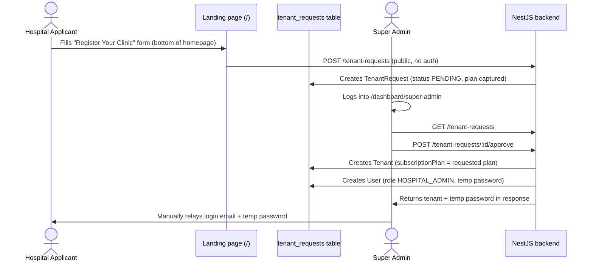
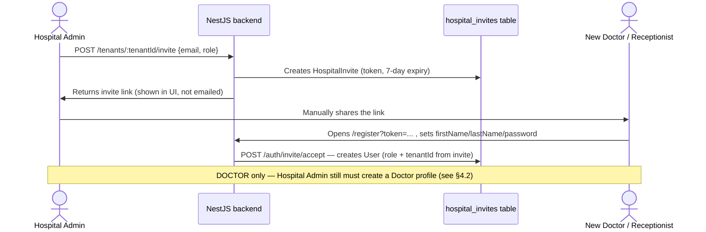

# Arogyix — Onboarding Operations Manual

**Audience:** Super Admin / platform ops staff who process onboarding requests and hospital admins who provision their own staff.
**Scope:** `SUPER_ADMIN`, `HOSPITAL_ADMIN`, `DOCTOR`, `RECEPTIONIST`, `PATIENT`. **Pharmacy onboarding is out of scope for this manual** — it follows a separate flow (`/register/pharmacy-business` → `TenantType.PHARMACY`) and is not covered here.
**Verified against:** backend/frontend source as of 2026-08-19. Where this manual disagrees with `README.md` / `APP_FLOW.md` / `CLINIC_FLOW.md`, this document reflects the actual current code — see [§7 Known Gaps](#7-known-gaps--doc-corrections) for what changed.

---

## 1. Role Summary

| Role | Who creates the account | Self-service? | Requires a second setup step? |
|---|---|---|---|
| `SUPER_ADMIN` | Pre-seeded at deployment (`prisma/seed.ts`) | No | No |
| `HOSPITAL_ADMIN` | Super Admin, by approving a tenant request | Applicant submits the request; Super Admin approves | No |
| `DOCTOR` | Hospital Admin invites → invitee sets own password | Invitee completes their own signup via link | **Yes** — Hospital Admin must also create the Doctor profile |
| `RECEPTIONIST` | Hospital Admin invites → invitee sets own password | Invitee completes their own signup via link | No |
| `PATIENT` | Either front-desk (Receptionist) or self-signup | Both paths exist | Only if self-signed-up — see §5.2 |

**Nothing in the onboarding flow sends automated email or SMS today.** Every credential (temporary password, invite link) surfaces only in the browser UI of the person performing the action, who must relay it to the new user manually (verbally, chat, copy-paste, etc.). Plan any onboarding process around that constraint.

---

## 2. Super Admin — Pre-Provisioned Only

There is no way to create a `SUPER_ADMIN` account through the product — no endpoint accepts a `role` field on public registration, and the global `ValidationPipe` (`whitelist`/`forbidNonWhitelisted`) strips or rejects any attempt to smuggle one in.

**Procedure (one-time, per deployment/environment):**
1. Set `DATABASE_URL` for the target environment in `backend/.env`.
2. Run the seed script from `backend/`: `npx prisma db seed` (or `ts-node prisma/seed.ts`).
3. This upserts `superadmin@Arogyix.health` / `Password123!` as `SUPER_ADMIN`, plus a demo tenant with a seeded `HOSPITAL_ADMIN`, `DOCTOR`, `RECEPTIONIST`, and `PATIENT` for testing.
4. **Change the seeded password immediately in any non-local environment** — it's a well-known default committed to the repo (`backend/prisma/seed.ts`).

If a second Super Admin is needed, the only route today is to run a one-off script or manually update a `User` row's `role` — there is no admin UI for it.

---

## 3. Hospital Admin — Tenant Request → Approval

**Entry point:** the public landing page at `/` — scroll to (or land on) the **"Register Your Clinic / Hospital"** form under the pricing section. There is **no separate `/register` page for this** — `/register` is reserved for patient self-signup and staff invite acceptance (see §4–5).

**Procedure:**
1. Applicant fills in: clinic/hospital name, admin email, admin first/last name, phone (optional), address/city/state (optional), and picks a pricing plan on the cards above the form. `POST /tenant-requests` stores this as a `TenantRequest` with `status: PENDING` and `plan` set to whatever card was selected (defaults to `FREE` if the applicant skipped the pricing cards).
2. Super Admin logs in at `/login`, opens `/dashboard/super-admin`, and reviews the **Pending** tab — each row now shows the requested plan.
3. Super Admin clicks **Approve**. This:
   - Generates a unique tenant slug from the clinic name.
   - Creates the `Tenant` record with `subscriptionPlan` set from the request.
   - Creates a `User` with role `HOSPITAL_ADMIN`, `isVerified: true`, password = `Welcome@Arogyix2026` (fixed temp password, hashed).
   - Marks the request `APPROVED`.
4. The API response includes the tenant name/slug, admin email, and the temporary password. The frontend shows this **once**, in a modal, to the Super Admin — it is not stored anywhere else in plaintext and is not re-displayable. **Copy it before closing the modal.**
5. Super Admin manually sends the admin email + temp password to the applicant (email, phone, etc. — outside the system).
6. The Hospital Admin logs in at `/login` with those credentials. There is currently no forced password-change-on-first-login — advise them to change it from `/dashboard/settings` immediately.

**Rejecting:** clicking **Reject** on a pending request marks it `REJECTED`; the applicant is not notified automatically.

---

## 4. Doctor & Receptionist — Invite Link, Self-Set Password

Unlike Hospital Admin onboarding, staff onboarding is **invite-token based**: the Hospital Admin does not set a password for staff — the staff member sets their own when accepting the invite.

### 4.1 Procedure (both roles)
1. Hospital Admin goes to `/dashboard/staff` → **Invite Staff**.
2. Enters the staff member's email and picks a role (`DOCTOR`, `RECEPTIONIST`, or `HOSPITAL_ADMIN` — same invite mechanism works for a second admin too).
3. Clicking **Generate Invite Link** calls `POST /tenants/:tenantId/invite`, which creates a `HospitalInvite` valid for **7 days** and returns a token. The frontend builds `{origin}/register?token={token}` and displays it in the modal for the admin to **copy and send manually** (email/WhatsApp/etc.) — again, nothing is auto-emailed.
4. The invitee opens that link. Because a `token` query param is present, `/register` switches into "Activate your account" mode, asking only for first name, last name, and a password of their choosing.
5. Submitting calls `POST /auth/invite/accept`, which validates the token (not expired, not already used), creates the `User` with the role and tenant baked into the invite, and marks the invite used.
6. The new staff member can now log in at `/login` and is redirected to their role's dashboard.

**Expired or already-used links:** the admin must generate a fresh invite — there's no resend/regenerate-in-place option, just repeat step 3.

### 4.2 Doctor-specific extra step
A `DOCTOR`-role `User` account alone is **not** enough to be bookable — a `Doctor` profile record (specialization, qualification, registration number, consultation fee, schedule) must exist separately.

1. After the doctor accepts their invite (§4.1), go to `/dashboard/doctors` as Hospital Admin.
2. The "Add Doctor" flow lists `User`s with role `DOCTOR` at this tenant who don't yet have a `Doctor` profile.
3. Select the user, fill in specialization/qualification/registration number/experience/consultation fee/availability, and save (`POST /doctors`).
4. Only after this step does the doctor appear in appointment-booking doctor lists.

**Operationally: don't consider a doctor "onboarded" until both the invite is accepted and the profile is filled in — these can lag by days if nobody follows up.**

### 4.3 Receptionist
No second step — accepting the invite is sufficient. There's no separate `Receptionist` profile model.

---

## 5. Patient — Two Independent Paths

### 5.1 Path A — Front-Desk Registration (Receptionist, Doctor, or Hospital Admin)
1. Staff member goes to `/dashboard/patients` → **Add Patient**.
2. Required fields: email, first name, last name. Everything else (phone, DOB, gender, blood group, address, emergency contact, allergies) is optional and can be filled in later.
3. `POST /patients` (tenant-scoped):
   - If no `User` exists for that email yet, one is created automatically with a **random 8-character temp password**, role `PATIENT`, tied to this tenant. The password is returned once in the API response for the staff member to relay to the patient.
   - If a `User` already exists for that email (e.g. they self-registered previously, or are a patient at another tenant), it's reused — a new `Patient` record is just added under this tenant, with no new password generated.
4. A unique `Patient Code` (e.g. `PAT-0042`) is generated automatically either way.

### 5.2 Path B — Self-Registration (Patient, directly)
1. Patient goes to `/register` (no token) and fills in email, phone (optional), first/last name, password (min 8 chars).
2. `POST /auth/register` creates a `PATIENT`-role `User` **with no tenant attached at all**.
3. They can log in immediately, but most of the patient dashboard is tenant-scoped — a tenant-less patient has nothing to see until a hospital's front desk "claims" them.
4. **The claim happens implicitly**: if any clinic later runs the Path A "Add Patient" flow using the *same email*, the system finds the existing tenant-less `User` and attaches a `Patient` record under that tenant — no manual linking UI exists for this.

**Operational implication:** if you want self-registered patients to actually become usable at a specific hospital, front-desk staff still need to run them through Path A (using the same email) once they show up in person or over the phone. Self-registration alone does not onboard a patient into any clinic.

---

## 6. Credential & Communication Cheat Sheet

| Role | Password set by | Where it's shown | Auto-delivered? |
|---|---|---|---|
| Super Admin | Seed script (fixed) | Not shown anywhere post-seed | No |
| Hospital Admin | System (fixed: `Welcome@Arogyix2026`) | Super Admin's approval modal, once | No — Super Admin relays manually |
| Doctor / Receptionist | The invitee themselves | N/A — invitee chooses it | Invite *link* shown to admin once — no auto-send |
| Patient (front-desk) | System (random 8-char) | Front-desk staff's screen, once | No — staff relays manually |
| Patient (self-signup) | The patient themselves | N/A | N/A |

Because nothing is emailed automatically, **build a manual "relay credentials" step into whatever SOP or checklist your ops team follows** for each of these — a missed copy-paste is the most likely failure mode today.

---

## 7. Known Gaps / Doc Corrections

These were confirmed against the current codebase and differ from what `APP_FLOW.md` / `CLINIC_FLOW.md` describe — treat this manual as authoritative until those are updated:

- **No welcome email on tenant-request approval.** `APP_FLOW.md`'s sequence diagram shows one; the code has no such call (`notifications` module is never invoked from `tenant-requests`).
- **No invite email either** — `backend/src/tenants/tenants.service.ts` has a `// TODO: Send invite email` stub; the link is only ever shown in-app.
- **Staff onboarding is not "admin sets a password"** — `CLINIC_FLOW.md` describes the admin entering a temporary password for new staff; in reality the invitee sets their own via the invite-link flow.
- **Doctor onboarding is two steps, not one** — accepting the invite only creates the login account; a separate `Doctor` profile must be filled in by the admin before the doctor can be booked.
- **Self-registered patients are tenant-less** until a clinic runs them through front-desk registration with the same email — they don't get automatic hospital access just by signing up.
- **The hospital registration entry point is the homepage (`/`) pricing/registration section**, not a dedicated `/register` route as earlier docs implied.

---

## 8. Quick Reference — Endpoints by Step

| Step | Endpoint | Auth |
|---|---|---|
| Submit hospital registration | `POST /tenant-requests` | Public |
| List registration requests | `GET /tenant-requests` | Super Admin |
| Approve registration | `POST /tenant-requests/:id/approve` | Super Admin |
| Reject registration | `POST /tenant-requests/:id/reject` | Super Admin |
| Invite staff (Doctor/Receptionist/2nd Admin) | `POST /tenants/:tenantId/invite` | Hospital Admin / Super Admin |
| Accept staff invite | `POST /auth/invite/accept` | Public (token-gated) |
| Create Doctor profile | `POST /doctors` | Hospital Admin / Super Admin |
| Register patient (front-desk) | `POST /patients` | Hospital Admin / Doctor / Receptionist |
| Self-register (patient) | `POST /auth/register` | Public |
| Login (all roles) | `POST /auth/login` | Public |
