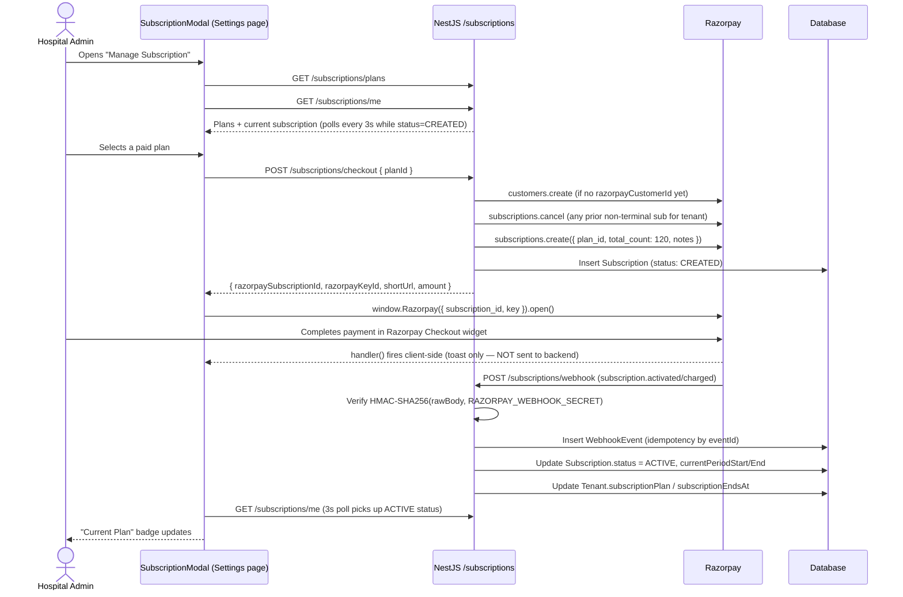

# Arogyix — Razorpay Integration & Subscription Billing Flow

This document details the SaaS subscription billing system: how tenants (hospitals) are billed via Razorpay, the full checkout-to-activation lifecycle, the data model, and known gaps in the current implementation.

> **Scope note:** This document covers *SaaS subscription billing* (the `subscriptions` backend module — what a hospital pays Arogyix). It does **not** cover the separate `billing` module, which handles patient-facing consultation invoices within a clinic (no payment gateway involved there — `Invoice.status` is flipped to `PAID` manually by a receptionist). Do not conflate the two; they share no code path.

---

## 🏗️ Architecture Overview

| Module | Path | Role |
| :--- | :--- | :--- |
| `subscriptions` | `backend/src/subscriptions/` | Owns all Razorpay interaction: checkout, webhook receipt, subscription lifecycle. |
| `billing` | `backend/src/billing/` | Patient consultation invoices (PDFKit generation, manual `markAsPaid`). No gateway. |
| `tenants` | `backend/src/tenants/` | Tenant CRUD. Reads plan/subscription state via the `subscriptions` module; owns no Razorpay logic itself. |
| `tenant-requests` | `backend/src/tenant-requests/` | Public hospital registration → Super Admin approval. Carries a `plan` field through to `Tenant.subscriptionPlan` but never talks to Razorpay. |

Arogyix uses Razorpay's **Subscriptions API** (recurring, plan-based billing) — not the Orders API. There is no one-off "pay ₹X now" order/payment flow anywhere in the codebase; every paid charge is a recurring subscription cycle.

---

## ⚙️ Razorpay Client Setup

**`backend/src/subscriptions/razorpay.service.ts`**

The Razorpay SDK client (`razorpay@^2.9.8`) is lazily initialized on first use, not at app boot:

```ts
@Injectable()
export class RazorpayService {
  private _client: Razorpay | null = null;
  get client(): Razorpay {
    if (!this._client) {
      const key_id = process.env.RAZORPAY_KEY_ID;
      const key_secret = process.env.RAZORPAY_KEY_SECRET;
      if (!key_id || !key_secret) {
        throw new ServiceUnavailableException(
          'Razorpay is not configured (missing RAZORPAY_KEY_ID/RAZORPAY_KEY_SECRET)',
        );
      }
      this._client = new Razorpay({ key_id, key_secret });
    }
    return this._client;
  }
}
```

Lazy init means the app can boot without Razorpay credentials configured; any endpoint that actually needs a paid checkout fails with a 503 at call time instead of crashing on startup.

### Environment variables

**Backend** (`backend/.env.example`):
```env
# Razorpay (SaaS subscription billing)
RAZORPAY_KEY_ID="rzp_test_xxxxxxxxxxxxxx"
RAZORPAY_KEY_SECRET="your-razorpay-key-secret"
RAZORPAY_WEBHOOK_SECRET="your-razorpay-webhook-secret"
```

**Frontend**: no Razorpay-related env var exists (confirmed — no `NEXT_PUBLIC_RAZORPAY_*` anywhere). The public checkout key is never hardcoded client-side; the backend returns `razorpayKeyId` in the checkout response and the frontend uses that value to construct `window.Razorpay`.

---

## 🗄️ Data Model (`backend/prisma/schema.prisma`)

```prisma
// SAAS SUBSCRIPTION BILLING (Razorpay)  — schema.prisma:204

enum SubscriptionPlan {
  FREE
  BASIC
  PROFESSIONAL
  ENTERPRISE
}

enum BillingCycle {
  MONTHLY
  YEARLY
}

enum SubscriptionStatus {
  CREATED
  ACTIVE
  PENDING
  HALTED
  CANCELLED
  COMPLETED
  EXPIRED   // defined but never assigned by any code path — see Known Gaps
}

model Plan {
  id               String
  tier             SubscriptionPlan
  billingCycle     BillingCycle
  name             String
  priceInPaise     Int              // integer paise, not Decimal rupees
  currency         String           @default("INR")
  razorpayPlanId   String?          @unique   // null for FREE tier
  features         Json
  maxDoctors       Int?             // nullable = unlimited
  maxPatients      Int?
  isActive         Boolean          @default(true)

  @@unique([tier, billingCycle])
}

model Subscription {
  id                     String
  tenantId               String
  planId                 String
  razorpaySubscriptionId String?  @unique
  razorpayCustomerId     String?
  status                 SubscriptionStatus @default(CREATED)
  currentPeriodStart     DateTime?
  currentPeriodEnd       DateTime?
  cancelAtPeriodEnd      Boolean  @default(false)
  shortUrl               String?
  notes                  Json?
}

model WebhookEvent {
  id          String
  provider    String    @default("razorpay")
  eventId     String    @unique     // idempotency key
  eventType   String
  payload     Json
  processedAt DateTime?
  error       String?
}
```

`Tenant` also carries a **denormalized cache** of the currently active tier directly on the tenant row: `subscriptionPlan SubscriptionPlan @default(FREE)` and `subscriptionEndsAt DateTime?`, plus a `subscriptions Subscription[]` relation to the full history. Guards and dashboard reads generally use the fast cached fields on `Tenant`; the `Subscription` rows are the detailed/auditable record.

---

## 🔄 End-to-End Lifecycle



### Step-by-step

1. **Registration**: A hospital applicant submits `/register` → `POST /tenant-requests` → `TenantRequestsService.create()`. The `TenantRequest.plan` field defaults to `FREE` — the current register page does not actually present a plan picker to the user, so every incoming request lands as FREE regardless of the field's "selected on the landing page" intent.
2. **Approval**: A `SUPER_ADMIN` approves the request (`TenantRequestsService.approve()`), which creates the `Tenant` row (`subscriptionPlan: request.plan`) and a `HOSPITAL_ADMIN` user. **No Razorpay call and no `Subscription` row happen at this point** — the tenant simply starts on the FREE cache value.
3. **Plan selection**: Post-login, the `HOSPITAL_ADMIN` opens **Settings → Manage Subscription**, which renders `SubscriptionModal` (`frontend/components/SubscriptionModal.tsx`). This is the only subscription UI in the app — there is no dedicated `/dashboard/*/billing` route.
4. **Checkout creation** — `POST /subscriptions/checkout { planId }` → `SubscriptionsService.createCheckout()`:
   - **FREE tier**: inserts an `ACTIVE` `Subscription` row directly and updates `Tenant.subscriptionPlan`. No Razorpay call.
   - **Paid tier**: requires `Plan.razorpayPlanId` to be set (404 if not backfilled). Reuses/creates a Razorpay `customer`, cancels any prior non-terminal subscription for the tenant, then calls `razorpay.client.subscriptions.create({ plan_id, customer_notify: 1, total_count: 120, notes })`. `total_count: 120` is a deliberate workaround — Razorpay's Subscriptions API requires a finite cycle count even for an "indefinite" plan, so 120 monthly cycles (~10 years) stands in for indefinite. A `Subscription` row is inserted with `status: CREATED`.
5. **Razorpay Checkout widget**: The frontend loads `https://checkout.razorpay.com/v1/checkout.js` from Razorpay's CDN via `next/script` (not an npm package), then opens `window.Razorpay({ key: razorpayKeyId, subscription_id, prefill, theme })`.
6. **Client-side "success"**: Razorpay's `handler` callback only shows a toast and invalidates the `current-subscription` query — **it does not POST `razorpay_payment_id`/`razorpay_signature` back to the backend**. There is no client-driven verification endpoint in this codebase at all.
7. **Server-side verification (the real source of truth)**: Razorpay sends a server-to-server webhook to `POST /subscriptions/webhook` (public route, `@Public()`). The handler verifies an HMAC-SHA256 signature computed over the **raw** request body (raw-body capture is enabled globally via `NestFactory.create(AppModule, { rawBody: true })`) against `RAZORPAY_WEBHOOK_SECRET`, using `crypto.timingSafeEqual` for constant-time comparison.
8. **Idempotency**: Each webhook payload is inserted into `WebhookEvent` keyed by Razorpay's event `id` (or a SHA-256 hash of the raw body as fallback). A unique-constraint collision means the event was already processed, so it's acknowledged without reprocessing.
9. **State transition**: On `subscription.activated` or `subscription.charged`, `Subscription.status` → `ACTIVE`, `currentPeriodStart`/`currentPeriodEnd` are set from Razorpay's `entity.current_start`/`current_end`, and this cascades into `Tenant.subscriptionPlan`/`subscriptionEndsAt` — this webhook handler is the **only** code path that ever promotes a tenant's live tier.
10. **Other events**: `subscription.authenticated` → `CREATED`; `subscription.pending` → `PENDING`; `subscription.halted` → `HALTED`; `subscription.cancelled` → `CANCELLED`; `subscription.completed` → `COMPLETED`. Anything else (e.g. `payment.failed`, `subscription.updated`) is recorded in `WebhookEvent` only, no state change.
11. **Frontend reflects activation**: While `current-subscription`'s status is `CREATED`, the modal polls `GET /subscriptions/me` every 3 seconds; once the webhook lands and flips status to `ACTIVE`, the next poll picks it up and the Settings page "Current Plan" badge updates.
12. **Cancellation**: `POST /subscriptions/:id/cancel` calls `razorpay.client.subscriptions.cancel(id, true)` (cancel-at-cycle-end) and sets `cancelAtPeriodEnd: true` locally. The actual `status → CANCELLED` transition still only happens once the `subscription.cancelled` webhook arrives.
13. **Renewal**: Handled implicitly by Razorpay — it auto-charges each billing cycle and re-fires `subscription.charged`, which re-runs the same `ACTIVE` update block and refreshes `currentPeriodEnd`.

---

## 📡 API Reference

### Backend routes — `backend/src/subscriptions/subscriptions.controller.ts`

| Method | Route | Auth | Description |
| :--- | :--- | :--- | :--- |
| `GET` | `/subscriptions/plans` | JWT | List active `Plan` rows. |
| `GET` | `/subscriptions/me` | JWT, `HOSPITAL_ADMIN` | Current tenant's subscription + plan. |
| `POST` | `/subscriptions/checkout` | JWT, `HOSPITAL_ADMIN` | Body: `{ planId }`. Creates/returns a Razorpay subscription (or activates FREE directly). |
| `POST` | `/subscriptions/:id/cancel` | JWT, `HOSPITAL_ADMIN` | Cancels at end of current billing cycle. |
| `POST` | `/subscriptions/webhook` | `@Public()` (Razorpay signature instead of JWT) | Receives and verifies Razorpay subscription lifecycle events. |

### Frontend — `frontend/lib/api.ts`

```ts
export const subscriptionApi = {
  getPlans: () => api.get('/subscriptions/plans'),
  getCurrent: () => api.get('/subscriptions/me'),
  checkout: (planId: string) => api.post('/subscriptions/checkout', { planId }),
  cancel: (id: string) => api.post(`/subscriptions/${id}/cancel`),
};
```

### DTO

```ts
// backend/src/subscriptions/dto/subscription.dto.ts
export class CreateCheckoutDto {
  @IsString()
  planId: string;
}
```

The amount and currency are never client-supplied — both are derived server-side from the `Plan` row identified by `planId`, which prevents a tampered client from paying an arbitrary amount.

---

## 🖥️ Frontend Component — `SubscriptionModal.tsx`

- Mounted in exactly one place: `frontend/app/dashboard/settings/page.tsx`, behind a "Manage Subscription" button on the Current Plan card.
- Loads Razorpay's Checkout script via `<Script src="https://checkout.razorpay.com/v1/checkout.js" strategy="lazyOnload" onReady={...} />`.
- Fetches `subscription-plans` and `current-subscription` (React Query) while open; the latter polls every 3s only while status is `CREATED`.
- On selecting a plan: `POST /subscriptions/checkout`. FREE tier resolves immediately (toast + close); paid tiers open the Razorpay widget with `subscription_id`, `key`, `prefill` (tenant name/admin email/phone), and `theme.color: '#0891b2'`.
- Plan cards render tier, name, `priceInPaise / 100` formatted as currency, billing cycle, and feature list; the current plan is highlighted and its Select button disabled.

---

## 🛠️ Operational Scripts

| Script | Path | Wired to `npm run`? | Purpose |
| :--- | :--- | :--- | :--- |
| `seed-plans.ts` | `backend/prisma/seed-plans.ts` | Yes — `npm run seed:plans` | Seeds `Plan` rows in the DB (no Razorpay calls). |
| `create-razorpay-plans.ts` | `backend/prisma/create-razorpay-plans.ts` | **No** — must run manually via `ts-node` | Calls `razorpay.plans.create(...)` for each DB `Plan` and backfills `razorpayPlanId`. Must be run once per environment before paid checkout will work in that environment. |

---

## ⚠️ Known Gaps / Things to Be Aware Of

These are real characteristics of the current implementation, not hypothetical risks — worth knowing before extending this system:

1. **No client-driven payment verification.** The Razorpay Checkout `handler` callback never posts `razorpay_payment_id` / `razorpay_subscription_id` / `razorpay_signature` back to the backend. All state changes are 100% webhook-driven. This is actually the *more* correct pattern for subscriptions (client-side confirmation is inherently spoofable), but it does mean the UI can show an optimistic "success" toast several seconds before the backend has actually confirmed the charge — the 3-second poll is what closes that gap.
2. **Webhook processing failures are swallowed.** If `handleEvent()` throws, the error is caught and written to `WebhookEvent.error`, but the endpoint still returns `200 { received: true }`. Razorpay will not retry a failed event, since it only retries on non-2xx responses. A failed event silently sits in the `WebhookEvent` table with an `error` field and no automatic reconciliation.
3. **No expiry/renewal cron.** `ScheduleModule` is registered globally and used elsewhere (`reminders` module), but nothing in `subscriptions/` uses `@Cron`. `SubscriptionStatus.EXPIRED` exists in the schema but no code path ever sets it. If Razorpay stops sending webhooks for a tenant (e.g. after repeated failed charges leave it `HALTED`), the tenant's cached `subscriptionPlan`/`subscriptionEndsAt` will go stale with no automatic downgrade.
4. **Plan selection isn't wired into registration.** `TenantRequest.plan` exists and is intended to be "selected on the landing page," but the current `/register` page doesn't present a plan choice, so every new tenant request defaults to `FREE`. Upgrading happens later, manually, via the Settings modal.
5. **`create-razorpay-plans.ts` is a manual step.** New environments (or new `Plan` rows added via `seed-plans.ts`) need this script run by hand before their `razorpayPlanId` is populated — until then, checkout for that tier will 404.
6. **No dedicated billing/subscription page.** All subscription management lives inside a modal on the general `/dashboard/settings` page, gated server-side to `HOSPITAL_ADMIN`.

---

## Related Files Quick Reference

```
backend/src/subscriptions/
  ├── subscriptions.module.ts
  ├── subscriptions.controller.ts   # routes incl. /webhook
  ├── subscriptions.service.ts      # checkout, cancel, webhook handling
  ├── razorpay.service.ts           # lazy Razorpay client
  └── dto/subscription.dto.ts       # CreateCheckoutDto

backend/prisma/
  ├── schema.prisma                 # Plan, Subscription, WebhookEvent models
  ├── seed-plans.ts                 # npm run seed:plans
  └── create-razorpay-plans.ts      # manual, backfills razorpayPlanId

frontend/
  ├── components/SubscriptionModal.tsx
  ├── lib/api.ts                    # subscriptionApi
  └── app/dashboard/settings/page.tsx
```
